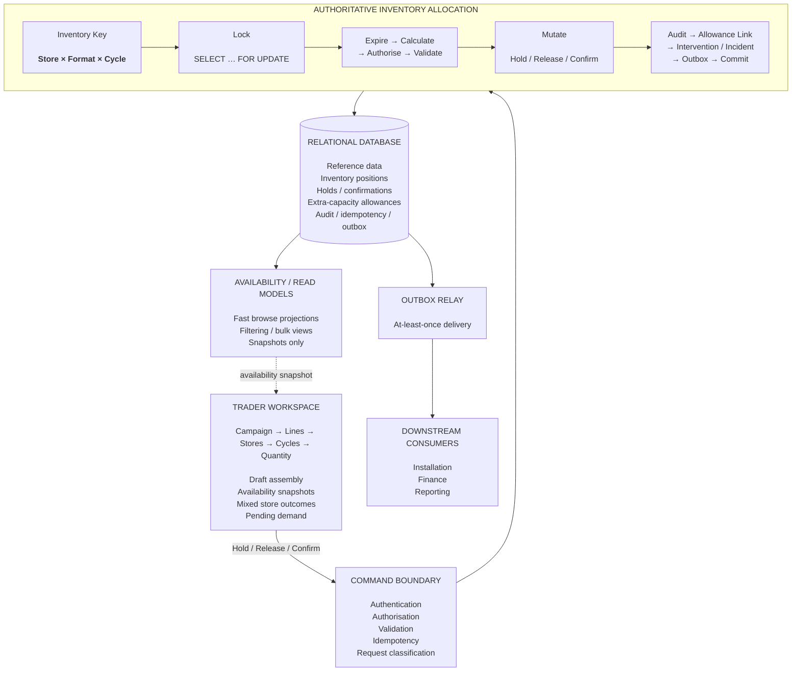
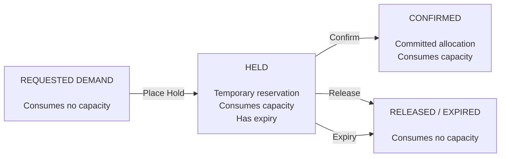
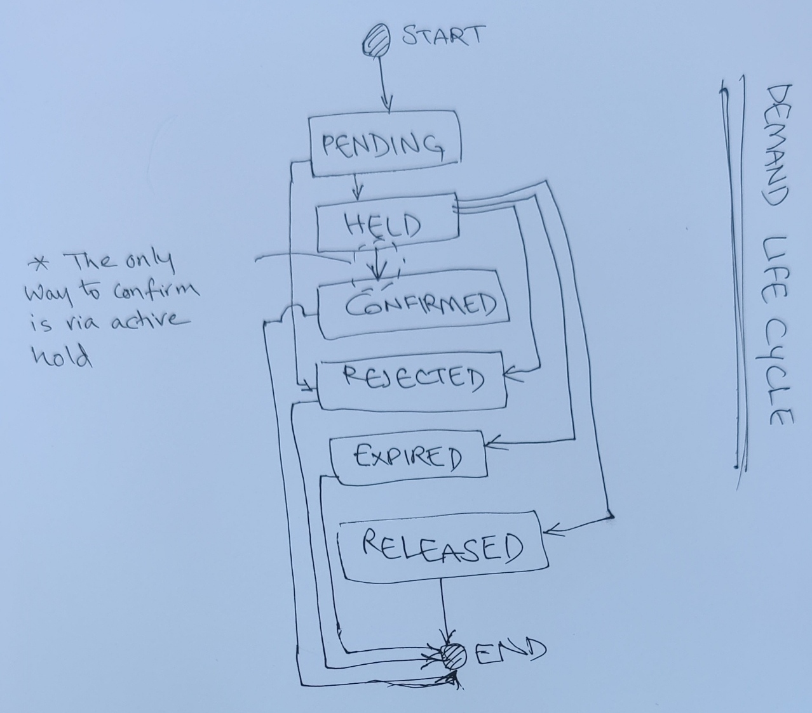
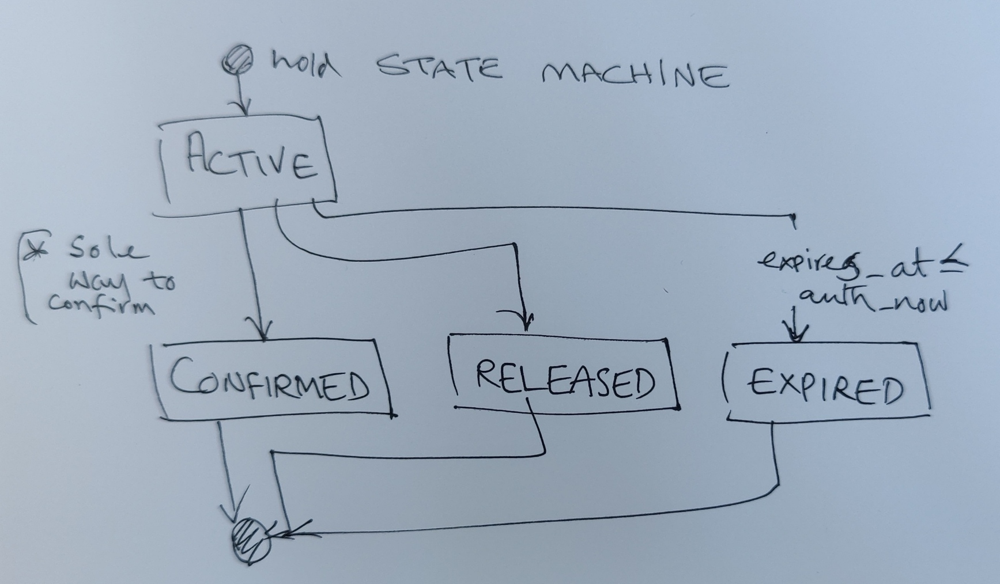
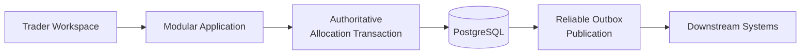
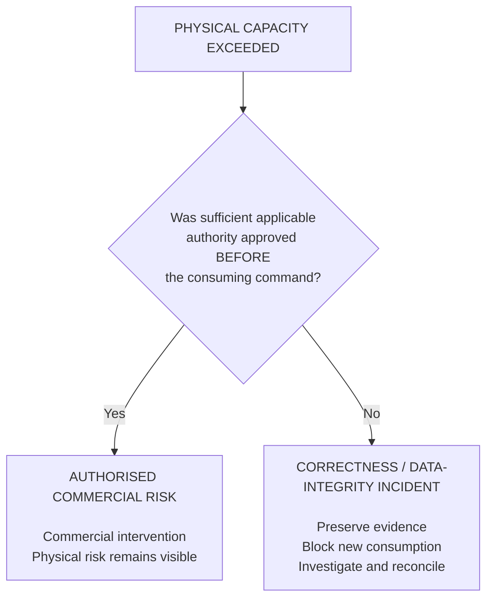

# Booking lifecycle and contention

## From trader intent through to authoritative inventory allocation

I chose to go deepest on **booking lifecycle and contention**.

The architectural principle is:

> **Commercial intent is optimistic; inventory allocation is pessimistic.**

Traders should be able to assemble and revise campaign demand freely. But the moment an action consumes contested physical inventory — placing a hold or confirming an allocation — it crosses a strongly consistent transactional boundary.

That is the part of the system I would protect most carefully.

If availability search is slow, traders are frustrated. If allocation is wrong, two advertisers can both be told they successfully acquired the same finite physical inventory. That failure propagates into campaign operations, installation and downstream commercial data.

This is therefore a **two-hour depth slice**, not an attempt to specify the entire platform.

---

# 1. What does the system look like end-to-end?



I would start with a **modular application backed by PostgreSQL as the authoritative system of record**.

The system naturally separates into four concerns:

| Area                    | Responsibility                                                                        | Consistency                   |
| ----------------------- | ------------------------------------------------------------------------------------- | ----------------------------- |
| **Reference data**      | stores, formats, physical capacity, trading cycles                                    | read-heavy, relatively static |
| **Campaign assembly**   | advertisers, campaigns, lines, store selections, requested quantities, pending demand | optimistic                    |
| **Inventory truth**     | holds, confirmations, releases, expiry, exceptional-capacity authority                | **strong transactional**      |
| **Audit & integration** | material transitions, actors, idempotency, downstream publication                     | durable                       |

These are consistency and ownership boundaries, not a requirement for four services.

A modular monolith is sufficient initially.

---

## Availability is computed, then immediately untrusted

The natural contention key is:

```text
(store, format, cycle)
```

For example:

```text
Store 142
Aisle Barrier
Cycle 8
```

A trader might see:

```text
Physical capacity     6
Confirmed             3
Active holds          2
Available             1
```

But `Available = 1` is only true at the instant it was calculated.
Another trader may consume it immediately afterwards.

The UI, browse query and any cache can tell a trader what appeared available.
Only the allocation transaction can tell them what they actually acquired.

---

# Demand is not inventory

A campaign line expresses demand.

For example:

```text
Campaign line

Format       Aisle Barrier
Store        142
Cycle        8
Requested    4
```

That request consumes nothing simply by existing.

The inventory lifecycle is separate.



There is also:

```text
PENDING AVAILABILITY
```

which means:

> The advertiser still wants this quantity, but no capacity has been reserved.

Pending demand:

- consumes no capacity;
- carries no guarantee;
- establishes no priority;
- is not automatically allocated if capacity later becomes free.

That distinction prevents commercial intent from accidentally becoming inventory truth.

<figure>
    
    <figcaption>A demand (full) life cycle - The sole way to confim is via an ACTIVE HOLD</figcaption>
    
</figure>
<figure>
    
    <figcaption>HOLD state machine diagram</figcaption>
    
</figure>

---

# Quantity is conserved

For each demand item, quantity can move between dispositions,
but must never disappear or be duplicated.

Suppose the requested quantity is 4 and only two are currently bookable.
After the advertiser accepts that partial outcome:

```text
Held                  2
Pending availability  2
Confirmed             0
Rejected              0
────────────────────────
Total                  4
```

The invariant is:

> **Every unit of requested demand has exactly one current disposition.**

A transition may move quantity between states.

It may not silently create, duplicate or lose quantity.

---

# 2. Where did I choose to go deep, and why?

I chose to go deepest on the transition from:

```text
"I would like this inventory"
```

to:

```text
"The business has now reserved or committed this inventory."
```

More specifically:

> **How does the system guarantee that concurrent legitimate actions cannot accidentally consume the same finite capacity?**

That is the highest-risk engineering boundary in this problem.

The core invariant is:

```text
No successful allocation command may consume capacity
that was neither physically available nor covered by
valid prior commercial authority.
```

---

# The authoritative inventory position

I would maintain one `inventory_position` for each:

```text
(store_id, format_id, cycle_id)
```

Conceptually:

```text
inventory_position

store_id
format_id
cycle_id

active_held_quantity
confirmed_quantity

updated_at
```

That row has two jobs:

1. provide an efficient current aggregate;
2. provide the lock target for competing allocation transactions.

I would still retain individual allocation records.

So the design is deliberately hybrid:

```text
Allocation records
    = explainable business facts

InventoryPosition
    = current aggregate + concurrency lock

Audit history
    = immutable material transition history
```

I would **not** store a naked `available_quantity` as independent truth.

Availability is derived.

---

# Hold and Confirm answer different questions

A useful distinction is:

```text
HOLD

"May I reserve this capacity now?"
```

versus:

```text
CONFIRM

"Is my reservation still valid,
and may it now become committed?"
```

### Hold

Hold is where new capacity is normally acquired.

It therefore carries the primary last-unit contention problem.

### Confirm

Confirmation may not increase total consumed quantity:

```text
held      -1
confirmed +1
```

but it still changes shared authoritative state.

It must therefore use the same inventory serialisation boundary.

It also needs to establish:

- that the hold still exists;
- that it has not expired;
- that it has not already been released or confirmed;
- that any exceptional-capacity authority is valid for the **resulting confirmed disposition**.

So Confirm is shorter than first-touch allocation.

It is not lock-free.

---

# Concrete transaction choice

For this design I would use:

```text
PostgreSQL
READ COMMITTED
+
explicit SELECT … FOR UPDATE
```

on the affected `inventory_position`.

`SERIALIZABLE` would also be credible.

I prefer explicit row locking here because:

- contention is expected rather than unusual;
- the number of concurrent traders is modest;
- critical sections should be short;
- the lock target maps directly to the business contention key;
- the resulting behaviour is straightforward to reason about and test.

The design does not rely on PostgreSQL-specific business semantics, but PostgreSQL gives a concrete implementation model for proving the races.

---

# The Hold transaction

A Hold command is approximately:

```text
BEGIN

1. Claim / validate idempotency key

2. Establish authoritative database time

3. Lock:
       inventory_position(store, format, cycle)
       FOR UPDATE

4. Materialise any holds already logically expired
   at that authoritative time

5. Calculate:
       consumed =
           confirmed_quantity
         + active_held_quantity

6. Read physical capacity

7. Determine applicable approved extra capacity,
   if this operation is eligible to use any

bookable =
    physical
+ applicable extra
− consumed

8. Validate:
       demand state
       requested quantity
       capacity
       allowance entitlement

9. If requested > bookable:
       write no allocation for this item
       return conflict + non-binding offer

10. If requested <= bookable (valid):
       create Hold
       update InventoryPosition
       record allowance coverage if required
       record audit evidence
       create/update commercial intervention if required
       write outbox event
       retain idempotent result

COMMIT
```

The important point is:

> **Capacity validation and capacity consumption happen inside the same transaction while the contention key is locked.**

The hot transaction does not scan years of allocation history.

The current aggregate answers the allocation question; the underlying allocation facts and reconciliation prove that aggregate remains trustworthy.

---

# Race 1 — two traders request the last unit

Initial state:

```text
Physical capacity   6
Confirmed           3
Held                2

Available           1
```

Trader A and Trader B have both already seen:

```text
Available = 1
```

Then:

```text
Trader A                         Trader B

BEGIN                            BEGIN

lock inventory row
                                 attempts same lock
                                 waits

recalculate available = 1

create hold
held = 3

COMMIT

                                 lock acquired

                                 recalculate available = 0

                                 cannot create hold

                                 return conflict / unavailable
```

Both traders can race.

Only one can win.

That is the required behaviour.

---

# Bulk operations and deadlocks

A campaign may contain hundreds or thousands of store requests.

I would **not** lock an entire campaign in one transaction.

Normal atomicity is per independently contested demand item:

```text
store × format × cycle
```

Bulk Place Hold uses the requested quantity only. There is no open human decision in that command. If `requested > bookable`, do not write a smaller hold. Return a conflict and a non-binding offer.

So one bulk action may return:

```text
Store 001     HELD 4
Store 002     HELD 4
Store 003     UNAVAILABLE     bookable = 0
Store 004     CONFLICT        bookable = 2, requested = 4
                              no stock taken
                              companion offer: OFFERED 2 / PENDING 2
...
```

If the trader later submits Accept Offer `{ accepted: 2, pending: 2 }` and bookable is still 2:

```text
Store 004     HELD 2
              PENDING 2
```

If bookable has since fallen to 1:

```text
Store 004     STALE_OFFER
              allocation mutation = none
              revised offer: OFFERED 1 / PENDING 3
```

One bulk Hold may succeed on some stores and fail on others. That is required. A store that cannot satisfy the requested quantity is not held “a bit”. It is `UNAVAILABLE` or `CONFLICT` plus a non-binding offer. Quantity splits only after the advertiser’s decision is recorded on the accept command.

That keeps mixed store outcomes and lock duration small, without silent quantity shrink.
If a transaction genuinely needs more than one inventory row, locks should be acquired in deterministic order, for example:

```text
store_id
→ format_id
→ cycle_sequence
```

That removes a major class of deadlocks.

Deadlock or serialisation failure must still be treated as a normal retriable transaction failure rather than something assumed impossible.

---

# Race 2 — expiry versus confirmation

Suppose:

```text
expires_at = 10:00:00
```

The database clock is authoritative.

I would define the boundary explicitly:

```text
expires_at > authoritative_now
    → active

expires_at <= authoritative_now
    → expired
```

Therefore:

```text
expires_at = 10:00:00
now        = 10:00:00
```

means the hold has expired.

Confirmation cannot resurrect it.

---

# Expiry must not depend on a worker

I would still run a background process to:

- materialise expired status;
- publish notifications;
- tidy read models;
- perform housekeeping.

But that process is not part of inventory correctness.

If it is delayed for an hour, the authoritative transaction still evaluates:

```text
expires_at <= database_now
```

and treats the hold as expired.

So a worker outage can delay presentation.

It cannot strand expired capacity.

---

# Confirm transaction

For this depth slice I would make one reversible design choice:

> **Confirmation requires an active Hold.**

That is not a requirement from the brief. It is a first-slice simplification.

It gives the model one path for first-touch inventory acquisition:

```text
Demand
  ↓
Hold          ← creates the allocation and acquires capacity
  ↓
Confirm       ← updates that same allocation into a commitment
```

A future direct allocate-and-confirm command could reuse the same authoritative allocation boundary if traders genuinely need it. It is outside this slice.

## One allocation identity

Hold creates one allocation record:

```text
allocation

id
demand_item_id
inventory_position_id
quantity

status        = held
expires_at    = ...
confirmed_at  = null
```

If exceptional capacity was required, the Hold transaction also records durable allowance coverage showing which prior authority permitted that capacity to be consumed.

Confirm updates the **same allocation row**:

```text
status         held → confirmed
confirmed_at   = authoritative database now
```

`expires_at` is kept as history. After confirm it no longer governs activity.

`Release` and expiry also transition this same allocation identity:

```text
                 ┌──→ released
held ────────────┤
                 ├──→ expired
                 │
                 └──→ confirmed
```

Material transitions are also written to append-only history:

```text
HOLD_PLACED
HOLD_RELEASED
HOLD_EXPIRED
HOLD_CONFIRMED
```

This gives the system:

```text
one current allocation identity
+
an immutable history of how it changed
```

For this slice I assume a Hold is confirmed in full. If a later requirement allows partial confirmation, that becomes an explicit quantity split whose resulting portions must still sum exactly to the original held quantity.

## Lock order

All inventory-mutating commands locks in the same order:

```text
1. inventory_position rows
   ordered by:
   (store_id, format_id, cycle_sequence)

2. allocation / hold rows
   ordered by allocation_id

3. extra_capacity_allowance rows
   ordered by allowance_id
   when new or changed allowance entitlement is required
```

Confirm locks the position before the hold row. Confirm does not take new extra capacity, so it does not need the allowance lock.

A consistent global order removes a major class of deadlocks. Deadlock or serialisation failure is still treated as a retriable transaction outcome rather than assumed impossible.

## The transaction

```text
BEGIN

1. Idempotency key
   same key + same fingerprint → stored result
   same key + different body   → reject

2. Authoritative now = database time

3. Lock inventory_position FOR UPDATE
   then lock the allocation row

4. Require:
       status = held
       expires_at > now
       quantity is this hold's quantity

   If expires_at <= now:
       mark expired
       active_held_quantity -= quantity
       reject confirm
       do not resurrect the hold
       pending demand gets nothing

5. If this hold used extra capacity,
   check the coverage stored at Hold time
   against the resulting CONFIRMED disposition.

   Net consumed may be unchanged.
   That is not sufficient.
   Hold-only coverage → reject; the row stays held.
   Closed-to-new-use does not erase coverage that
   was already valid for confirmation.

6. Same row:
       status held → confirmed
       confirmed_at = now

7. Position aggregates only:
       active_held_quantity -= quantity
       confirmed_quantity   += quantity

8. If confirmed_quantity > physical_capacity,
   escalate the commercial intervention case.
   Assert uncovered_overallocation = 0.

9. Outbox allocation.confirmed
   Store idempotent result

COMMIT
```

## Why the position lock stays

Suppose:

```text
physical capacity = 6
held              = 2
confirmed         = 3
```

One transaction is confirming a Hold:

```text
held       2 → 1
confirmed  3 → 4
```

while another trader is placing a new Hold and calculating:

```text
bookable
=
physical
- held
- confirmed
```

Confirm does not take new stock, but it still writes held and confirmed on `inventory_position`. A concurrent Hold is reading that same pair to compute bookable. Without the row lock, one command can decide against a half-updated pair.

`Confirm` must validate **ownership, expiry, current state and resulting-disposition authority**, not merely the capacity arithmetic.

---

# Race 3 — the transaction committed but the client never found out

Suppose:

```text
database COMMIT succeeds
        │
        ▼
network response disappears
        │
        ▼
client retries
```

Without idempotency, that may create a second hold.

Every inventory-mutating command therefore requires:

```text
idempotency key
+
request fingerprint
```

Example:

```text
First request:

key         ABC
command     Hold 2
fingerprint X

COMMIT succeeds
```

The client retries:

```text
key         ABC
command     Hold 2
fingerprint X
```

The server returns the stored successful result.

It does not create another hold.

If the same key arrives with a different fingerprint:

```text
key         ABC
command     Hold 3
fingerprint Y
```

the server rejects it.

The goal is not exactly-once message delivery.

It is:

> **effectively-once business behaviour under retries.**

---

# Partial availability is a commercial decision

Suppose:

```text
requested = 4
bookable  = 2
```

The system must not silently create:

```text
Hold 2
```

Instead it returns a non-binding offer:

```text
2 currently holdable
2 unavailable
```

The trader can discuss this with the advertiser.

If the advertiser accepts:

```text
Hold      2
Pending   2
```

the trader submits that exact decision.

No database transaction remains open while the human conversation happens.

---

# Race 4 — stale partial acceptance

Suppose the advertiser accepted:

```text
Hold      2
Pending   2
```

Before the trader submits that acceptance, another trader consumes one unit.

Current availability is now:

```text
1
```

The system must not silently turn the advertiser's decision into:

```text
Hold      1
Pending   3
```

Instead:

```text
allocation mutation = none

new non-binding offer:
    Holdable = 1
```

The trader must obtain a new commercial decision.

That protects both:

- inventory correctness;
- the meaning of the advertiser's consent.

---

# Explicit commercial exception versus accidental over-allocation

The other part of the design I would be deliberately strict about is overselling.

Suppose:

```text
Physical capacity = 6
```

The business may explicitly decide that it is willing to sell seven.

That can be a valid commercial decision.

But these two states must never become equivalent:

```text
A. A human explicitly authorised +1 before allocation.

B. A race, migration or bug accidentally created booking #7.
```

I would never implement overselling as:

```text
if user_is_privileged:
    ignore capacity
```

or:

```text
allow negative availability
```

Instead there is a separate object:

```text
extra_capacity_allowance

store
format
cycle

quantity

eligible actor / campaign where required
eligible disposition / action

reason
requested_by
approved_by
approved_at

status
```

Physical capacity remains:

```text
6
```

It never becomes:

```text
7
```

For a command that is eligible to use the allowance:

```text
Physical capacity                  6
Applicable approved extra         1
Effective limit for this command  7
```

The two quantities stay separate and auditable.

---

# Authorised commercial risk

Consider:

```text
Physical capacity             6
Confirmed                     6
Active holds                  1

Physical overcapacity         1
Valid authorised coverage     1
Uncovered overallocation      0
```

That is:

> **authorised commercial risk**

The allocation transaction should durably create or update a commercial intervention case.

The case belongs to the inventory position.

I would not arbitrarily label one advertiser as “the oversold advertiser”.

---

# Accidental over-allocation

Now consider:

```text
Physical capacity             6
Confirmed                     6
Active holds                  1

Physical overcapacity         1
Valid authorised coverage     0
Uncovered overallocation      1
```

That is categorically different.

It is a:

> **correctness / data-integrity incident**

The system should:

- preserve the evidence;
- block further ordinary consumption of that inventory key;
- investigate the cause;
- assess whether a permission/security bypass occurred;
- reconcile the state.

It should not silently convert that state into accepted oversell risk.

---

# Prior authorisation matters

This sequence must never rewrite history:

```text
bug creates booking #7
        │
        ▼
someone notices
        │
        ▼
human creates +1 allowance
        │
        ▼
system now labels booking #7 "authorised"
```

The allowance must have existed and been applicable **before the consuming command**.

A later allowance may authorise future actions.

It cannot retroactively legitimise an earlier defect.

---

# Resulting disposition matters

Assume an allowance can authorise:

```text
HOLD
```

but not:

```text
CONFIRMATION
```

The system currently has:

```text
Physical      6
Confirmed     6
Extra Hold    1
```

The trader attempts:

```text
HELD → CONFIRMED
```

A simplistic check might say:

```text
total consumption changed by 0
therefore confirmation is safe
```

That is insufficient.

The correct question is:

> **Does valid exceptional authority exist for the resulting CONFIRMED disposition?**

This keeps:

```text
temporary exceptional reservation
```

distinct from:

```text
exceptional confirmed commitment
```

even when their capacity arithmetic is identical.

---

# Explicit allowance-policy assumption

For this slice I would model an allowance as explicitly declaring which dispositions it may cover:

```text
HOLD
CONFIRM
or both
```

I would not assume all approvals automatically apply to both.

Likewise, closing an allowance to **new use** does not erase historical coverage already consumed while it was valid.

Whether an already-covered Hold may subsequently Confirm after closure depends on the allowance's confirmed-disposition policy.

That is a business rule, not something I would hide inside arithmetic.

---

# 3. Key trade-offs

| Choice                                             | Why I chose it                                                                                     | What could change later                                                                              |
| -------------------------------------------------- | -------------------------------------------------------------------------------------------------- | ---------------------------------------------------------------------------------------------------- |
| **Modular monolith over microservices**            | Allocation, allowance evidence, audit and outbox can commit atomically in one database transaction | Extract services when scaling, team ownership or operational boundaries justify the distributed cost |
| **PostgreSQL row locks over optimistic retries**   | Contention is expected, concurrency is modest and the lock grain maps cleanly to the domain        | Benchmark OCC or `SERIALIZABLE` if measured lock contention becomes significant                      |
| **Fungible quantity over named physical units**    | The current product sells quantities such as `6 aisle barriers`, not specific physical slots       | Add a fulfilment / position-assignment model if installation later needs individual identities       |
| **Per-item outcomes over campaign-wide atomicity** | Supports mixed outcomes and keeps transactions narrow                                              | Introduce explicit atomic groups if future business rules require several items to succeed together  |
| **Snapshot availability over reservation-on-read** | Avoids speculative reservations during browsing                                                    | Improve read freshness independently if measurements justify it                                      |
| **Transactional aggregate + allocation facts**     | Allocation decisions remain fast while history stays reconstructable                               | Revisit storage strategy only if measured volume or reporting requirements justify it                |

---

# What I consciously kept shallow

This is a depth choice rather than an omission.

## Trader workspace

I would expect:

- accessible bulk selection;
- virtualised large store lists;
- keyboard workflows;
- progressive batch results;
- visible hold expiry;
- conflict recovery;
- no optimistic display of an uncommitted Hold.

I have not gone deep on frontend state management because it does not determine whether inventory can be double-booked.

## Pricing and invoicing

Out of scope.

The important boundary is simply:

> **Only confirmed allocations may appear downstream as confirmed commitments.**

## Installation

I am not designing field scheduling.

Accurate confirmed inventory and visibility of authorised physical overcapacity are integration constraints.

## Infrastructure topology

I would initially expect:

- stateless application instances;
- managed PostgreSQL;
- ordinary horizontal scaling;
- observability;
- backup and restore;
- CI/CD.

I see no requirement yet for microservice or Kubernetes complexity to solve the allocation problem.

## Commercial resolution of oversell

The system must detect and surface authorised physical risk.

The exact business process for resolving it remains a human workflow to define.

I would not silently invent cancellation or reassignment rules.

---

# What would I do with more time, money or team?

My first investment would be **proof and operability**, not more services.

I would build deterministic concurrency tests against the real PostgreSQL engine.

I would add property/model-based tests around quantity conservation and state transitions.

I would introduce failure injection around:

- network loss after commit;
- event publication failure;
- worker delay;
- transaction timeout;
- deadlock / retry;
- stale client actions.

I would improve reconciliation and commercial-risk tooling.

Only when measurements justified it would I consider:

- read replicas;
- CDC-fed availability projections;
- additional caches;
- service extraction;
- dedicated analytical infrastructure.

---

# 4. How would I know it is working — and when it stops?

A busy holds-per-hour graph is not evidence that the system is correct.

> **Working means the invariants survive the races the domain creates.**

I would prove that first, then monitor it continuously.

---

# Tests I would run against real PostgreSQL

## 1. Last physical unit

```text
Two concurrent Hold(1)
physical available = 1

Expected:
exactly one succeeds
```

---

## 2. Last exceptional unit

```text
Applicable extra allowance remaining = 1

Two concurrent exceptional Hold(1)

Expected:
exactly one succeeds
and exactly that allocation receives the coverage link
```

---

## 3. Stale partial acceptance

```text
Offer:
Hold 2
Pending 2

Availability drops to 1 before acceptance

Expected:
no allocation mutation
revised non-binding offer returned
```

---

## 4. Confirmation at expiry

```text
expires_at <= database_now

Confirm request arrives

Expected:
confirmation rejected
hold cannot be resurrected
released capacity becomes ordinarily bookable
pending demand receives nothing automatically
```

---

## 5. Allowance eligibility

```text
Allowance valid for HOLD only

Exceptional Hold succeeds

Confirm attempted

Expected:
Confirm fails unless confirmation-valid coverage exists
```

---

## 6. Unknown commit outcome

```text
Hold commits
HTTP response disappears
client retries same idempotency key

Expected:
stored original success
exactly one Hold
```

---

## 7. Publisher unavailable

```text
Confirmation commits
outbox publisher unavailable

Expected:
allocation remains confirmed
outbox row remains pending
publisher retries later
```

---

## 8. Reconciliation

```text
SUM(active holds)
+
SUM(confirmed allocations)
```

must match:

```text
inventory_position.active_held_quantity
+
inventory_position.confirmed_quantity
```

subject to the same authoritative expiry semantics.

---

# Continuous integrity signals

For each inventory key:

```text
consumed
=
confirmed
+
active holds
```

Then:

```text
physical_overcapacity
=
max(
    0,
    consumed - physical_capacity
)
```

and:

```text
uncovered_overallocation
=
physical_overcapacity
-
valid_authorised_coverage
```

After every successful ordinary or authorised allocation command:

```text
uncovered_overallocation = 0
```

That is the primary integrity invariant.

---

# Signal → likely meaning

| Signal                                                  | Likely meaning                                                                                             |
| ------------------------------------------------------- | ---------------------------------------------------------------------------------------------------------- |
| **`uncovered_overallocation > 0`**                      | Defect, bad migration, unsafe administrative change or allocation path bypass                              |
| **Reconciliation drift ≠ 0**                            | Transactional aggregate and allocation facts disagree                                                      |
| **Confirm succeeds after expiry**                       | Time/expiry semantics differ between execution paths                                                       |
| **Partial acceptance succeeds with different quantity** | System silently changed the recorded advertiser decision                                                   |
| **Physical exposure > 0 but intervention case missing** | Authorised commercial risk has become operationally invisible                                              |
| **Confirmed outbox events ageing**                      | Source-of-record remains correct, but downstream commitment views are stale                                |
| **Lock wait / timeout rises materially**                | Correctness may still hold, but contention is threatening availability and transaction design needs review |

This distinction matters:

```text
capacity conflict
```

can be healthy.

If two traders request the final unit:

```text
1 success
1 conflict
```

means the system worked.

By contrast:

```text
high lock timeout
high deadlock retry
transaction timeout
```

is infrastructure contention.

I would not confuse scarce inventory with a broken database.

---

# Exceptional inventory signals

I would expose separately:

```text
physical overcapacity

authorised oversell exposure

confirmed fulfilment shortfall

uncovered overallocation

open commercial intervention cases

open correctness incidents
```

For example:

```text
Physical capacity     6
Confirmed             7
Valid coverage        1
```

means:

```text
Uncovered overallocation       0
Confirmed fulfilment shortfall 1
```

The booking is authorised.

But the commercial risk has crystallised into more confirmed commitments than physical capacity.

That escalates the commercial intervention workflow.

The system should not silently cancel or amend the confirmation.

---

# Downstream health

Confirmation and its outbox event commit together.

Therefore:

```text
DB COMMIT succeeds
event infrastructure fails
```

must result in:

```text
confirmed allocation remains valid
outbox event remains pending
publication retries
```

I would monitor:

- oldest unpublished confirmed event;
- outbox backlog;
- publication retry rate;
- permanent publication failures;
- consumer deduplication failures.

The source of truth and downstream world may temporarily differ in freshness.

They must not differ in meaning.

---

# The dashboard I would want

```text
BOOKING HEALTH
──────────────────────────────────────────────

INVENTORY INTEGRITY
Uncovered overallocation                0
Reconciliation drift                    0
Confirm-after-expiry violations         0

TRANSACTION HEALTH
Allocation attempts
Successful allocations
Expected business conflicts
Lock wait
Deadlock / transaction retry rate

LIFECYCLE HEALTH
Active holds
Expired-hold materialisation lag
Idempotent replay failures              0

COMMERCIAL RISK
Authorised physical overcapacity
Confirmed fulfilment shortfall
Open intervention cases

INTEGRATION
Oldest unpublished confirmation
Permanent publication failures         0
```

I would establish concrete latency thresholds from representative tests rather than inventing them before seeing the deployment environment and normal workload.

The two figures I care about most are:

```text
Uncovered overallocation = 0
Reconciliation drift     = 0
```

because together they answer:

> **Can I still trust what this system says has been reserved and confirmed?**

---

# Assumptions and open questions

I would keep these explicit rather than hiding them inside the design.

### Proposed assumptions for this slice

- Physical units of one format within a store are fungible.
- A campaign is associated with one advertiser.
- The trader records advertiser decisions; no advertiser self-service workflow is assumed.
- Confirmation originates from an active Hold in the first slice.
- Authoritative time comes from the database.
- `expires_at <= now` means expired.
- PostgreSQL is the system of record.
- Extra-capacity allowances explicitly declare the dispositions they may authorise.

### Still open

- default and maximum Hold duration;
- Hold extension rules;
- exact approval/separation-of-duty policy for extra capacity;
- whether direct allocate-and-confirm is ever required;
- whether already-covered exceptional Holds may Confirm after allowance closure under each allowance policy;
- how a commercial intervention is eventually resolved;
- whether physical capacity may be corrected during an active trading period.

None of these prevents the core concurrency design from being implemented safely.

---

# AI tooling reflection

AI was useful as a **structure and pressure-testing tool**, not as architectural authority.

## Where it helped

It was useful for:

- organising the four questions in the brief;
- checking terminology consistency;
- enumerating race conditions;
- challenging the design with stale clients, retries and worker delays;
- producing initial architecture diagrams and alternative presentations.

## Where I pushed back

Some plausible-looking suggestions were wrong or too loose.

Examples included:

- making Confirm lock-free because total consumption does not change;
- treating all physical overcapacity as “oversell” without distinguishing valid authority;
- allowing state diagrams where Confirmed inventory flows back into Released;
- treating stale partial acceptance as permission to silently shrink the quantity;
- treating an allowance as a global increase in physical capacity.

Those are exactly the kinds of mistakes that sound reasonable until the invariant is made explicit.

## What I retained ownership of

I would personally defend:

- the choice of angle;
- the contention key;
- availability being a snapshot rather than truth;
- the use of a single authoritative allocation path;
- the fungible-capacity model;
- quantity conservation;
- the distinction between authorised commercial risk and uncovered overallocation.

AI can help ask:

> “What race have you forgotten?”

It should not decide what the business is allowed to promise.

---

# What I would build next

In order:

1. **`inventory_position` + Hold / Release / Expire**  
   Row locking, authoritative time, idempotency, audit and outbox.

2. **Confirm from an active Hold**  
   Including expiry race and resulting-disposition validation.

3. **Extra-capacity allowance + coverage + case / incident**  
   Prove that deliberate oversell and accidental over-allocation can never collapse into the same state.

4. **Campaign lines + partial offer / acceptance + pending remainder**  
   Enforce quantity conservation and no silent shrink.

5. **Trader browse / read projections**
   Fast enough for thousands of stores. Still a snapshot.

That is the sequencing decision I would defend most strongly:

> **Pin the write path before polishing the estate map.**

---

# Closing position

The overall architecture is deliberately conventional:



The sophistication belongs in the **correctness boundary**, not necessarily in the deployment topology.

The transition I care about most is:

```text
"I would like this inventory"
              │
              ▼
"The business has reserved
 or committed this inventory"
```

That transition must remain correct when:

- two traders act concurrently;
- availability is stale;
- holds expire;
- requests are retried after an unknown outcome;
- only part of the requested quantity is available;
- workers are delayed;
- downstream publication fails;
- the business deliberately authorises exceptional capacity.

And throughout all of those cases, one distinction must remain impossible to blur:



If that distinction survives contention, retries, expiry and failure, then the core booking lifecycle is doing its job.
