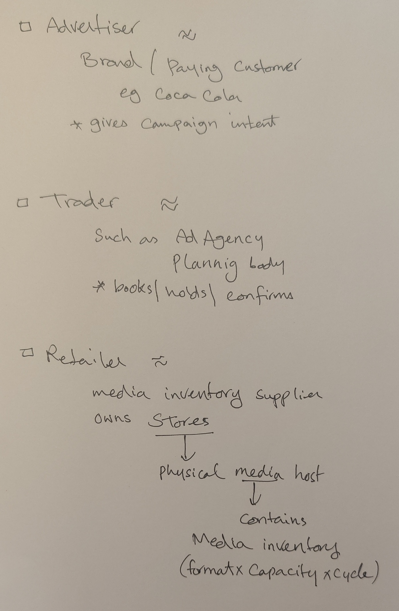
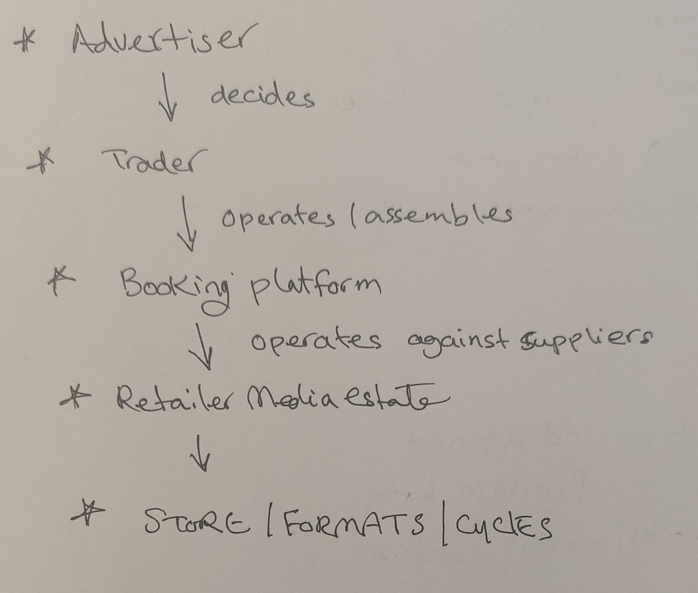
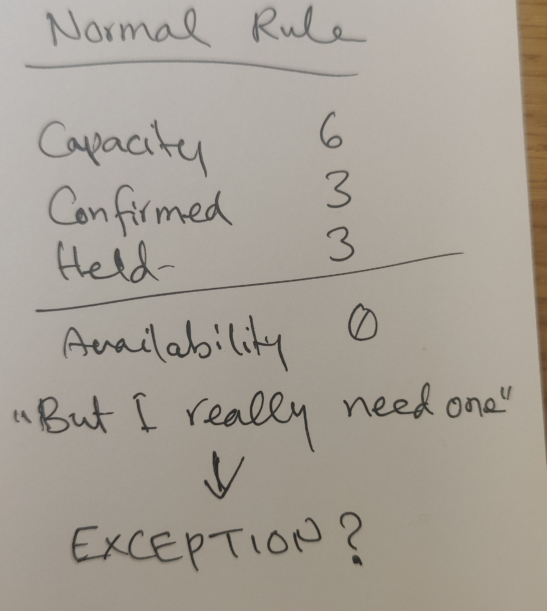
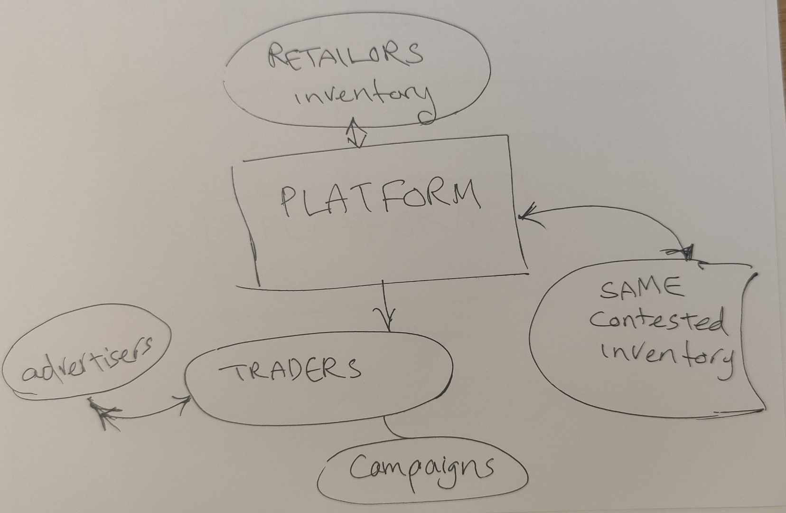
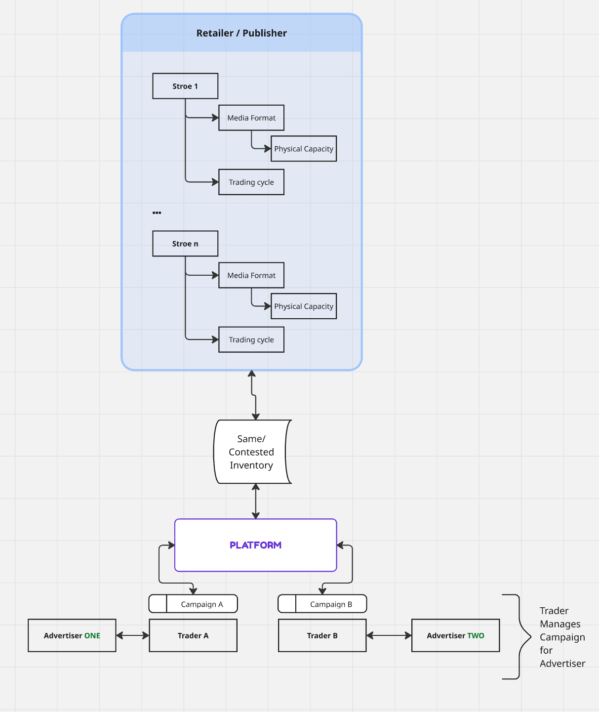

# Discovery & Working Notes — Retail Media Booking Platform

FOR SMG STAGE 2 TECHNICAL TASK

# Table of content

| Table of content                                               |
| -------------------------------------------------------------- |
| Intro                                                          |
| Understanding the brief                                        |
| Understanding the domain                                       |
| Explicit Assumptions, Interpretation and Domain Clarifications |
| Further breaking assumptions                                   |
| Explicit scope inherited from the brief                        |
| The resulting technical problem                                |
| Angle of choice                                                |

# Intro

This is Bruce Royce's submission `working-notes.md` file for SMG's 2nd Stage task for Tech Lead position.
These are the working notes produced while analysing the brief under the stated two-hour time box. They intentionally preserve early questions, discarded interpretations and rough sketches to show how I arrived at the submitted design.

For this task I am presented with a [brief in a Microsoft Word docx format - Read here](software-engineering-stage-2-technical-task-v.2.docx).

The brief is presenting a realistic (but likely not real) retail media inventory booking problem and asks for some level of solution as stated in the brief.

### Tools:

- VS Code for drafting;
- AI tools including `ChatGPT`, `Grok` and `Gemini` for challenge, review, domain exploration and alternative modelling.
- Material AI assistance is disclosed in the main submission's AI reflection.

### AI Usage Note

When I used a bulk of AI generated material, I clearly marked them or placed them in an external file and pointed to them.

# 1) Understanding the brief

My initial step is obviously to try to understand the brief and the domain within the given scope as well as I possibly can, before I can confidently go ahead with picking an angle to answer the brief questions.

**The problem's title may make it sound like an easy problem. It is not!**

The brief literature itself is a confirmation that this is not a simple design. Upon reviewing the brief there are inherit complexities as well as inherent ambiguities that indicates the complex nature of the problem.

- First, I tried to create a mental image of the operation.
- I realised that I don't neccesirly have all the information I need.
- I also noted that I have many questions and I realised some parts of the operation that I imagine may not make perfect sense to me.
- I noted that the brief is silent about some matters or used an ambiguous language to explain them.
- The brief scoped the requirement, so I left questions that may sit outside of the scope away, unless they have cascading impact on my within-the-scope questions.
- The brief introduced assumptions, to help with the 2-hours run. It allows for further assumptions if strictly written and addresses as per the brief's instruction.

I decided it is crucial to spend enough time to decipher and properly understand the domain, actors and operation before making any calls.
I created a list of my questions and fed both the brief, my questions and my initial mental model to `ChatGPT 5.6 Sol` in attempt to make utmost clarifications possible.

---

# 2) Understanding the domain

## A) Initial mental image: Flight seat booking look alike?

My initial mental image was: "This closely resembles _"flight seat booking"_." While I see this was a good starting point, that image was gradually improved to distinguish enough significant areas of difference.
For fungible capacity, in the airline analogy we aren't “booking a seat”; the operation is in fact is booking one unit of capacity in a flight/cabin or fare bucket before a specific seat is assigned.

**What mapped faily well:**

| Flight / cabin / departure | ≈ Store / format / cycle   |
| -------------------------- | -------------------------- |
| Seat-capacity bucket       | ≈ Fungible media capacity  |
| Temporary reservation      | ≈ Hold                     |
| Committed booking          | ≈ Confirmation             |
| Overbooking authority      | ≈ Extra-capacity allowance |

The analogy breaks down quickly at the campaign/workflow level, so I used it only to reason about fungible capacity and contention.

_At the lowest inventory level, fungible availability has similarities to airline capacity management: there is a fixed quantity, temporary holds, contention for the last unit and potentially authorised oversell. But the wider workflow is different because we’re assembling campaigns across many stores and cycles with partial success._

## B) Explicit Assumptions, Interpretation and Domain Clarifications

The brief introduces the following domain terms:

### Retailer

supplier/owner of the store media inventory.

### Media

There are examples of the available media, such as "aisle barrier" but it is not specified whether these units are exchangeable (fungible) or not (addressable).

For a 2-hour practice I assumed they are fungible - see my assumption about units

### Advertiser

Brand/client wanting the media - whose campaign is being run.

### Store

physical host of that media inventory.

### Campaign

advertiser campaign assembled/managed by a Trader.

### Cycle

A fixed 4-week bookable span of time to book a media.

### Hold

provisional booking or temporary reservation that reduces availability until expiry.

### Confirmed

committed booking.

## The following are genuinely ambiguous

- Traders
- Exception & Oversell Risk
- Commercial Team

### TLDR

#### - Commercial Team

The organisational identity and approval structure are not defined by the brief.

For this design, I only require an explicitly authorised human capability for exceptional commercial decisions. The eventual organisational roles and separation-of-duty rules remain a business/security question.

#### - Oversell exception

explicit, authorised permission to increase in sellable capacity beyond (normal) physical capacity for a specific store, format and cycle. Normal holds continue to block inventory; overselling is never an accidental consequence of concurrency.

#### - Expired holds

simply return capacity to normal availability; no priority queue or advertiser-ranking system unless specified. (even if priority exists it goes beyond the defined scope)

#### - Trader

human commercial operator acting on the advertiser’s behalf and using the platform.

---

> **Early working sketch:** some labels here were hypotheses, not conclusions. In particular, I later dropped the assumptions that the Advertiser is necessarily the payer, that the Trader belongs to an agency, and that physical capacity is cycle-scoped. I eventually treats physical capacity as Store × Format, with occupancy evaluated at Store × Format × Cycle.

<figure>

<figcaption>System actors</figcaption>
<figure>

<figcaption>Assumed actors relationship</figcaption>
</figure>

---

## Rationale for these assumptions

### Trader

"Trader" is not sufficiently and explicitly defined in the brief.

The brief establishes that:

- an advertiser books media;
- a trader assembles the campaign while the advertiser decides;
- 20–30 traders may compete for the same inventory.

It does not establish whether the Trader is employed by, contracted to, or otherwise organisationally associated with the Advertiser, Retailer or SMG.

For this exercise I therefore model **Trader as a human commercial operator of the platform**, without making their employer or contractual relationship part of the domain model.

What matters to the booking design is their system role: they assemble campaign demand and issue Hold / Confirm / Release commands against contested retailer inventory.

```
                         RETAILER / PUBLISHER
                    owns the physical media estate
                              │
                ┌─────────────┴─────────────┐
                │                           │
             Store A                     Store B
                │                           │
          Media inventory             Media inventory
          by format/cycle             by format/cycle
                │
                └─────────────┬─────────────┘
                              │
                         booked through
                              │
                              ▼
                          PLATFORM
                              ▲
                              │ operates
                       ┌──────┴──────┐
                       │   TRADER    │
                       │  (person)   │
                       └──────┬──────┘
                              │
                        assembles campaign
                         on behalf of
                              │
                              ▼
                         ADVERTISER
                    Coca-Cola / P&G / etc.
```

**If I had more time :**

I would clarify organisational accountability and campaign ownership, although neither changes the inventory contention model explored here.

## Exception

The brief reads:

> “Holds are intended to block the space. In practice traders push hard for exceptions during peak, and commercial teams sometimes want to accept the risk of overselling.”

There are at least three possible meanings of exception:



### Interpretation A — ignore/bypass somebody else's hold

Trader A has provisional holds for Advertiser A.

Trader B says:

> My advertiser is ready to confirm immediately. Can I have one of those units despite the hold?

That's a commercially plausible exception.

If authorised:

```
Physical capacity       6
Confirmed               3
Held precieved          3
Hold released          -1  (needs **release mechanism**)
New confirmation       +1  (1 hold exceptionally bypassed in favour of 1 confirmed)
                        ───
Committed exposure       6

Physical inventory       6
```

**We've now deliberately created oversell risk.**

❌***Rejected: bypassing another active Hold would weaken the reservation invariant. Exceptional demand should use separately authorised extra capacity rather than invalidate an existing reservation.***

### Interpretation B — permit booking above physical capacity

More generally:

> “I know there are six physical units. Authorise us to sell seven.”

If authorised:

```
Physical capacity        6
Confirmed                3
Held                     3
New confirmation        +1
                        ───
Committed exposure       7

Physical inventory       6
```

That's the explicit oversell case.

### Interpretation C — exception to hold policy itself

For example:

> Extend my hold beyond its normal expiry.

**_That's also linguistically possible, but the sentence immediately connects exceptions with “accept the risk of overselling”, so I think B is much more likely._**

I would interpret the requirement as:

> Normal holds consume capacity and must be respected. An explicitly authorised commercial override may permit allocated consumption to exceed physical capacity.

**I would particularly want to know whether an oversell authorisation means: “For this store × format × cycle, commercial has authorised N units of additional sellable capacity above physical capacity.”**

# Assumed Domain Diagram

<figure>
    
    <figcaption>a high level simplistic domain overview</figcaption>
</figure>



[Miro: Assumption domain Diagram](https://miro.com/app/board/uXjVHsfoN1o=/?share_link_id=989606232723)

## What consumes capacity?

```text
Physical capacity (Store × Format)
                │
                │ applied to a Cycle
                ▼
        Inventory Position
      (Store × Format × Cycle)

Current consumption
    = Confirmed quantity
    + Active Held quantity

Expired / Released
    → consume nothing

Approved Extra Capacity
    → separate authority above physical capacity
    → never changes the physical-capacity fact
```

# 3) Further assumptions

Changing this assumption would materially change the inventory model: named physical positions would require an assignment layer rather than purely fungible quantity accounting.

### Media Units

I call one unit of a media format within a Store a "media unit".

For this two-hour exercise, I assume units of the same format within a Store are interchangeable (fungible), rather than individually addressable.

Changing this assumption would materially change the inventory model: named physical positions would require an assignment layer rather than purely fungible quantity accounting.

### Variable quantity

For each selected store and cycle, a campaign can request more than one unit of the same format

### Store-cycle unit granularity

Allocation outcomes are evaluated at store × format × cycle granularity.
ie. the system may reject one specific cycle for one store while the rest of the campaign remains valid

### Oversell

Authorised oversell exception is a hard authorised human decision and only happens by first increasing a separate approved capacity allowance.

### Campaign has multiple flexible lines

One campaign may contain several booking lines with different formats, store sets, cycle ranges, and quantities

Physical capacity is a Store × Format fact; booking occupancy is considered per Store × Format × Cycle.
Hold lifetime uses ordinary workflow time even though advertising occupancy is Cycle-based.
Expired inventory returns to ordinary availability; no priority/waiting-list mechanism is assumed.
“Exception” is treated as an explicitly authorised departure from normal capacity rules; its exact commercial semantics are acknowledged as underspecified.

# 4) Explicit scope inherited from the brief

The following are supplied assumptions and should not be redesigned as part of this exercise:

- Store estate is fixed for the modelled period.
- There is one Retailer.
- There is one Retailer trading calendar.
- Campaign media runs only in fixed four-week Cycles.
- Campaigns do not start or end mid-Cycle.
- Pricing is out of scope.
- Invoicing mechanics are out of scope.
- Installation logistics are out of scope.
- A Confirmed booking is not amended.

# 5) The resulting technical problem

After separating stated requirements from assumptions and ambiguities, the task can be expressed more precisely:

> A Trader uses the system to assemble advertising activity associated with an Advertiser. The activity consumes finite physical media capacity supplied by a single Retailer across its Store estate. Physical capacity exists by Store and Format; booking occupancy applies to specific four-week Cycles. Multiple Traders may concurrently attempt to secure the same capacity. Active Holds provisionally block capacity and later expire; Confirmed bookings consume capacity for the relevant Cycle; outcomes may be partial across Stores. Availability must therefore be derived from current inventory commitments rather than read from a single stored value. Normal concurrency must not accidentally allocate more than the physical capacity. At the same time, the business may deliberately accept overselling risk through an exceptional commercial decision whose exact semantics are not fully specified by the brief. Because booking data drives physical installation and invoicing downstream, accidental divergence between system state and physical reality is a material correctness failure.

That is the core problem.

## See my [Working Interpretation of the Technical Brief](appendix-working-Interpretation-of-the-technical-brief.md) in full

_(Working interpretation, notes and assumptions contain ideas I later improved or rejected or updated.)_

# 6) Responding to the taks:

## Angle of choice

## **Booking lifecycle and contention: From trader intent through to authoritative inventory allocation.**

I have chosen to go deepest on booking lifecycle and inventory contention because this is where the principal correctness risk lies. Multiple Traders can act concurrently on the same finite inventory; active Holds consume availability, Holds expire, booking outcomes may be partial, and the business may deliberately permit exceptional overselling.

I will sketch the system end-to-end, but concentrate the technical detail on how inventory is safely reserved, released and Confirmed under contention, and how an explicit commercial exception remains distinguishable from accidental over-allocation.

## Mental model I use

```
HUMAN / WORKFLOW WORLD
                         │
                         │ Trader intent
                         ▼
┌──────────────────────────────────────────────────────┐
│                     Trader UI                        │
│                                                      │
│ assemble Campaign → inspect → request → resolve     │
└────────────────────────┬─────────────────────────────┘
                         │
                  queries / commands
                         │
                         ▼
┌──────────────────────────────────────────────────────┐
│               APPLICATION / DOMAIN                   │
│                                                      │
│ Campaign assembly                                    │
│ Hold / Confirm / Release commands                    │
│ Availability queries                                 │
│ Exceptional commercial workflow                      │
└────────────────────────┬─────────────────────────────┘
                         │
                         ▼

════════════════════════════════════════════════════════ (BT ↑)

                 CORRECTNESS BOUNDARY

════════════════════════════════════════════════════════ (BB ↓)

                         │
                         ▼
┌──────────────────────────────────────────────────────┐
│              AUTHORITATIVE INVENTORY                 │
│                                                      │
│ Physical capacity                                    │
│ Active Holds                                         │
│ Confirmed allocations                                │
│ Explicit exceptional authorisations                  │
└────────────────────────┬─────────────────────────────┘
                         │
                         ▼
                 AUDIT / OPERATIONS
```

- Everything above border top (BT) may be stale, retryable or eventually refreshed.
- Everything below border bottom (BB) must preserve the inventory rules. any deliberate departure from physical capacity must be explicit and attributable.
- Inside the boundary, every deliberate departure from physical capacity must be explicit, prior-authorised and attributable.

## I am also thinking about these challenges

- What does the trader see while inventory is changing?
- What happens when availability shown five seconds ago is stale?
- How does partial success appear?
- How does the UI distinguish available, held by me, held elsewhere, confirmed, pending exception?
- What happens when a hold expires while a trader has the campaign open?
- What should an optimistic UI be allowed to assume?
- How do you communicate a concurrency conflict without presenting a meaningless "409 Conflict"?

## so, I expect my end-to-end to look like

```
Advertiser
    │
    │ commercial intent
    ▼
Trader
    │
    ▼
Trader Application
    │
    ▼
Application / Domain
    │
    ▼
Authoritative Inventory
    │
    ├── Capacity
    ├── Holds
    └── Confirmations
    │
    ▼
Audit / downstream consumers
```

## My line of development

```text
rough domain understanding
        ↓
ambiguities / assumptions
        ↓
finite contested capacity
        ↓
correctness boundary
        ↓
booking lifecycle + contention
```

## The design document itself is authoritative where the two differ

because working notes contain ideas I later improved or rejected or updated.
